<p align="center">
  <picture>
    <source media="(prefers-color-scheme: dark)" srcset="demo/files/logo-horizontal-dark.svg">
    <source media="(prefers-color-scheme: light)" srcset="demo/files/logo-horizontal-light.svg">
    
  </picture>
</p>

<p align="center">

[](https://github.com/scalefirstai/ContextSubstrate/actions/workflows/ci.yml)
[](https://goreportcard.com/report/github.com/contextsubstrate/ctx)
[](https://pkg.go.dev/github.com/contextsubstrate/ctx)
[](https://opensource.org/licenses/MIT)
[](https://github.com/scalefirstai/ContextSubstrate/releases/latest)

</p>

<p align="center"><strong>Reproducible, debuggable, contestable AI agent execution.</strong></p>

`ctx` is an execution substrate for AI agents that makes their work reproducible, debuggable, and contestable using developer-native primitives — files, hashes, diffs, and CLI workflows.

<p align="center">
  
</p>

## Quick Start

```bash
# Install from source
go install github.com/contextsubstrate/ctx/cmd/ctx@latest

# Initialize a context store in your project
ctx init

# Pack an agent execution log into an immutable context pack
ctx pack execution.json

# Inspect a context pack
ctx show <hash>

# List all context packs
ctx log

# Compare two packs for drift
ctx diff <hash-a> <hash-b>

# Replay an agent run step-by-step
ctx replay <hash>

# Verify artifact provenance
ctx verify <artifact>

# Fork a pack into a mutable draft
ctx fork <hash>
```

## Command Reference

| Command | Description |
|---------|-------------|
| `ctx init` | Initialize a `.ctx/` store in the current directory |
| `ctx pack <log-file>` | Create an immutable context pack from an execution log |
| `ctx show <hash>` | Inspect a context pack's contents |
| `ctx log` | List all finalized context packs |
| `ctx diff <hash-a> <hash-b>` | Compare two packs and produce a drift report |
| `ctx replay <hash>` | Re-execute an agent run step-by-step |
| `ctx verify <artifact>` | Validate artifact provenance against the store |
| `ctx fork <hash>` | Create a mutable draft from an existing pack |
| `ctx completion <shell>` | Generate shell completion (bash, zsh, fish, powershell) |

## Architecture

### Context Packs

A context pack is an immutable, content-addressed snapshot of an AI agent's execution. It captures:

- **Inputs** — files, prompts, and configuration the agent received
- **Steps** — the sequence of actions the agent performed
- **Outputs** — files and artifacts the agent produced
- **Metadata** — timestamps, agent identity, model parameters

Each pack is identified by a SHA-256 hash of its contents, making it tamper-evident and deduplicatable.

### Storage Layout

```
.ctx/
├── blobs/          # Content-addressed blob storage (SHA-256)
│   ├── ab/         # First two hex chars of hash
│   │   └── cdef…   # Blob file (remaining hash chars)
│   └── …
└── packs/          # Pack manifest registry
    └── <hash>      # Pack manifest files
```

### Core Concepts

- **Content-addressed storage** — Every blob is stored by its SHA-256 hash, ensuring deduplication and integrity
- **Immutable packs** — Once created, a pack's contents cannot be modified
- **Drift detection** — Compare two packs to see exactly what changed between agent runs
- **Replay** — Re-execute recorded steps to verify reproducibility
- **Provenance** — Verify that an artifact was produced by a specific agent run
- **Forking** — Create mutable drafts from immutable packs for iteration

### Execution Log Format

The `ctx pack` command accepts a JSON execution log with the following structure:

```json
{
  "agent": "agent-name",
  "model": "model-id",
  "timestamp": "2026-01-15T10:30:00Z",
  "inputs": [
    {"path": "src/main.go", "content": "..."}
  ],
  "steps": [
    {"action": "read", "target": "src/main.go"},
    {"action": "write", "target": "src/helper.go", "content": "..."}
  ],
  "outputs": [
    {"path": "src/helper.go", "content": "..."}
  ]
}
```

## Project Status

- [x] Content-addressed blob store
- [x] Context pack creation and inspection
- [x] Pack listing and registry
- [x] Structured diff / drift detection
- [x] Step-by-step replay with fidelity reporting
- [x] Artifact provenance verification
- [x] Pack forking for mutable drafts
- [x] Shell completion (bash, zsh, fish, powershell)
- [ ] Remote pack sharing (push/pull)
- [ ] Pack signing and verification
- [ ] Web UI for pack inspection
- [ ] IDE extensions

## Used By

- **[OpenRudder](https://github.com/scalefirstai/openrudder)** — Open source framework for change detection in microservices applications to build Ambient Agents. ContextSubstrate provides the execution substrate that makes OpenRudder's agent runs reproducible, auditable, and contestable.

## Non-Goals

- **Runtime agent orchestration** — `ctx` captures and analyzes execution, it does not run agents
- **Model hosting** — No inference, training, or model management
- **File synchronization** — Not a replacement for git, rsync, or cloud storage
- **Real-time monitoring** — Designed for post-hoc analysis, not live dashboards

## Contributing

See [CONTRIBUTING.md](CONTRIBUTING.md) for development setup, coding guidelines, and how to submit changes.

## License

[MIT](LICENSE) — see [LICENSE](LICENSE) for details.
